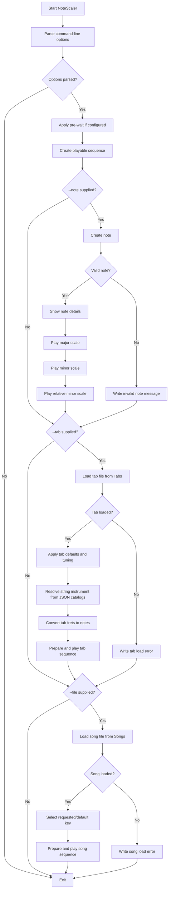

# NoteScaler

NoteScaler is a command-line music practice tool. It can display note details, play scales for a note, play song JSON files from the `Songs` directory, and play tablature JSON files from the `Tabs` directory.

This README focuses only on running the tool and using the command-line options.

## Running NoteScaler

From the repository root during development:

```bash
 dotnet run --project NoteScaler -- [options]
```

After publishing or installing the executable:

```bash
 NoteScaler.exe [options]
```

The `--` in the `dotnet run` form tells the .NET CLI to pass the remaining arguments to NoteScaler instead of treating them as `dotnet run` options.

## Common examples

Display note details and play the major, minor, and relative minor scales for C:

```bash
 dotnet run --project NoteScaler -- --note C
```

Use a different octave and A4 tuning reference:

```bash
 dotnet run --project NoteScaler -- --note A --octave 4 --range 432
```

Play a song file named `amazinggrace.json` from the `Songs` directory:

```bash
 dotnet run --project NoteScaler -- --file amazinggrace
```

Play a specific key/variation from a song file:

```bash
 dotnet run --project NoteScaler -- --file amazinggrace --key C
```

Play a tab file named `anotherbrickinthewallpart2.json` from the `Tabs` directory:

```bash
 dotnet run --project NoteScaler -- --tab anotherbrickinthewallpart2
```

Play a tab whose JSON file references an instrument by name:

```bash
 dotnet run --project NoteScaler -- --tab my-seven-string-tab
```

Pause before playback, then play using a different instrument voice:

```bash
 dotnet run --project NoteScaler -- --note C --prewait 2 --speed 300 --instrument Flute
```

## String instrument JSON

String instruments are loaded automatically. No command-line option is required.

NoteScaler always loads immutable base instruments from an embedded JSON resource. It also loads editable supplemental instruments from:

```text
Instruments/string-instruments.json
```

The embedded base instrument file is read-only to users because it is compiled into the application. The supplemental file is copied beside the application output and can be edited to add more instruments.

A tab chooses a string instrument through its `tuning` value:

```json
{
  "name": "Seven String Example",
  "speed": 1000,
  "strings": 7,
  "tab": "7-0,1-0",
  "tuning": "7 String Drop A",
  "repeat": 1
}
```

Supplemental instruments use this JSON shape:

```json
{
  "instruments": [
    {
      "name": "Mandolin",
      "aliases": ["My Mandolin"],
      "strings": 4,
      "frets": 20,
      "capo": 0,
      "openStrings": [
        { "number": 1, "note": "E5" },
        { "number": 2, "note": "A4" },
        { "number": 3, "note": "D4" },
        { "number": 4, "note": "G3" }
      ]
    }
  ]
}
```

`capo` is optional and defaults to `0`. When supplied, NoteScaler treats the configured open string note as the physical open tuning and shifts the sounding open note upward by the capo fret count.

Base instrument names are immutable. If the supplemental file defines a name or alias that already exists in the embedded base catalog, the embedded base definition wins.

## Command-line options

| Short | Long | Default | Description |
|---|---|---:|---|
| `-r` | `--range` | `440` | A4 reference frequency. Use this to tune calculations to a different A4 reference, such as `432`. |
| `-o` | `--octave` | `3` | Starting octave used when a note does not already include an octave. |
| `-w` | `--prewait` | `0` | Number of measures to wait before playback begins. The wait time is `prewait * speed`. |
| `-k` | `--key` | `null` | Selects a named key or variation when playing a song file. |
| `-s` | `--speed` | `300` | Measure duration used for note timing. Smaller values play faster; larger values play slower. |
| `-i` | `--instrument` | `Horn` | Instrument voice used for playback. Valid values are `Horn`, `Flute`, `Clarinet`, and `Recorder`. |
| `-n` | `--note` | `null` | Displays details for a note and plays its major, minor, and relative minor scales. |
| `-f` | `--file` | `null` | Plays a JSON song file from the `Songs` directory. Pass the file name without `.json`. |
| `-t` | `--tab` | `null` | Plays a JSON tab file from the `Tabs` directory. Pass the file name without `.json`. |

## Operation order

When multiple operation options are supplied, NoteScaler processes them in this order:

1. Parse command-line options.
2. Apply `--prewait` if configured.
3. Create the playable sequence.
4. Process `--note` if supplied.
5. Process `--tab` if supplied. The tab `tuning` value is resolved from the embedded base catalog plus the editable supplemental catalog.
6. Process `--file` if supplied.

That means a command can technically include more than one operation option, but the clearest usage is to run one primary operation at a time: `--note`, `--tab`, or `--file`.

## Flow chart


