# NoteScaler

NoteScaler is a command-line music practice tool. It can display note details, play scales for a note, play song JSON files from the `Songs` directory, play tablature JSON files from the `Tabs` directory, and play `.gtab` files from the `GTabs` directory.

This README focuses only on running the tool and using the command-line options.

## Running NoteScaler

From the repository root during development:

```bash
 dotnet run --project NoteScaler -- [options]
```

After publishing or installing the executable:

```bash
 NoteScaler.exe [options]
```

The `--` in the `dotnet run` form tells the .NET CLI to pass the remaining arguments to NoteScaler instead of treating them as `dotnet run` options.

## Common examples

Display note details and play the major, minor, and relative minor scales for C:

```bash
 dotnet run --project NoteScaler -- --note C
```

Use a different octave and A4 tuning reference:

```bash
 dotnet run --project NoteScaler -- --note A --octave 4 --range 432
```

Play a song file named `amazinggrace.json` from the `Songs` directory:

```bash
 dotnet run --project NoteScaler -- --file amazinggrace
```

Play a specific key/variation from a song file:

```bash
 dotnet run --project NoteScaler -- --file amazinggrace --key C
```

Play a song file and export the converted note sequence to MIDI:

```bash
 dotnet run --project NoteScaler -- --file maryhadalittlelamb --export-midi mary.mid --speed 1500
```

Play a tab file named `anotherbrickinthewallpart2.json` from the `Tabs` directory:

```bash
 dotnet run --project NoteScaler -- --tab anotherbrickinthewallpart2
```

Play a Guitar Tab Maker `.gtab` file named `maryhadalittlelamb.gtab` from the `GTabs` directory:

```bash
 dotnet run --project NoteScaler -- --gtab maryhadalittlelamb
```

Play a `.gtab` file and export it to MIDI:

```bash
 dotnet run --project NoteScaler -- --gtab maryhadalittlelamb.gtab --export-midi maryhadalittlelamb.mid
```

Play a tab whose JSON file references an instrument by name:

```bash
 dotnet run --project NoteScaler -- --tab my-seven-string-tab
```

Play a tab and export the same guitar performance events to a MIDI file:

```bash
 dotnet run --project NoteScaler -- --tab my-seven-string-tab --export-midi my-seven-string-tab.mid
```

Pause before playback, then play using a different instrument voice:

```bash
 dotnet run --project NoteScaler -- --note C --prewait 2 --speed 300 --instrument Flute
```

## String instrument JSON

String instruments are loaded automatically. No command-line option is required.

NoteScaler always loads immutable base instruments from an embedded JSON resource. It also loads editable supplemental instruments from:

```text
Instruments/string-instruments.json
```

The embedded base instrument file is read-only to users because it is compiled into the application. The supplemental file is copied beside the application output and can be edited to add more instruments.

A tab chooses a string instrument through its `tuning` value:

```json
{
  "name": "Seven String Example",
  "speed": 1000,
  "strings": 7,
  "tab": "7-0,1-0",
  "tuning": "7 String Drop A",
  "repeat": 1
}
```

Supplemental instruments use this JSON shape:

```json
{
  "instruments": [
    {
      "name": "Mandolin",
      "aliases": ["My Mandolin"],
      "strings": 4,
      "frets": 20,
      "capo": 0,
      "openStrings": [
        { "number": 1, "note": "E5" },
        { "number": 2, "note": "A4" },
        { "number": 3, "note": "D4" },
        { "number": 4, "note": "G3" }
      ]
    }
  ]
}
```

`capo` is optional and defaults to `0`. When supplied, NoteScaler treats the configured open string note as the physical open tuning and shifts the sounding open note upward by the capo fret count.

Base instrument names are immutable. If the supplemental file defines a name or alias that already exists in the embedded base catalog, the embedded base definition wins.

## .gtab files

`.gtab` files are JSON documents produced by Guitar Tab Maker. They are loaded from `GTabs` when the command value is a simple file name.

The first supported shape looks like this:

```json
{
  "cFret": 0,
  "title": "Mary Had A Little Lamb",
  "tempo": 120,
  "stringNotes": ["E", "A", "D", "G", "B", "E"],
  "version": 5,
  "lyricSize": 100,
  "tabRows": [
    {
      "lyricLines": [],
      "columnHeaders": [],
      "columns": [
        [
          { "p": "—", "s": "" },
          { "p": "0", "s": "" },
          { "p": "—", "s": "" },
          { "p": "—", "s": "" },
          { "p": "—", "s": "" },
          { "p": "—", "s": "" }
        ]
      ],
      "lyrics": ""
    }
  ]
}
```

The required fields are `title`, `stringNotes`, and `tabRows`. The loader uses numeric `p` values as frets, treats `—` as an empty string cell, ignores non-numeric technique markers in this first slice, and maps known `stringNotes` arrays such as `E,A,D,G,B,E` to existing NoteScaler tunings. `tempo` is captured, but current playback timing still comes from the command-line `--speed` option. Both sharp and flat aliases are recognized for the currently supported lowered standard tunings.

See `docs/gtab-schema.md` for the detailed Guitar Tab Maker adapter notes.

## MIDI export

MIDI export is file-based. It does not require a MIDI-capable guitar amp.

When `--export-midi` is supplied with `--tab`, NoteScaler writes a standard `.mid` file from the guitar performance events and then continues normal tab playback.

```bash
 dotnet run --project NoteScaler -- --tab anotherbrickinthewallpart2 --export-midi anotherbrickinthewallpart2.mid
```

When `--export-midi` is supplied with `--gtab`, NoteScaler normalizes the `.gtab` document into the existing tablature playback path, writes a standard `.mid` file from the guitar performance events, and then continues normal playback.

```bash
 dotnet run --project NoteScaler -- --gtab maryhadalittlelamb --export-midi maryhadalittlelamb.mid
```

When `--export-midi` is supplied with `--file`, NoteScaler writes a standard `.mid` file from the converted song note sequence and then continues normal song playback.

```bash
 dotnet run --project NoteScaler -- --file maryhadalittlelamb --export-midi mary.mid --speed 1500
```

The MIDI file contains note-on and note-off events derived from the resolved note sequence. Tab and `.gtab` export use guitar performance events. Song export uses the prepared composite note sequence that playback also consumes.

## Command-line options

| Short | Long | Default | Description |
|---|---|---:|---|
| `-r` | `--range` | `440` | A4 reference frequency. Use this to tune calculations to a different A4 reference, such as `432`. |
| `-o` | `--octave` | `3` | Starting octave used when a note does not already include an octave. |
| `-w` | `--prewait` | `0` | Number of measures to wait before playback begins. The wait time is `prewait * speed`. |
| `-k` | `--key` | `null` | Selects a named key or variation when playing a song file. |
| `-s` | `--speed` | `300` | Measure duration used for note timing. Smaller values play faster; larger values play slower. |
| `-i` | `--instrument` | `Horn` | Instrument voice used for playback. Valid values are `Horn`, `Flute`, `Clarinet`, and `Recorder`. |
| `-n` | `--note` | `null` | Displays details for a note and plays its major, minor, and relative minor scales. |
| `-f` | `--file` | `null` | Plays a JSON song file from the `Songs` directory. Pass the file name without `.json`. |
| `-t` | `--tab` | `null` | Plays a JSON tab file from the `Tabs` directory. Pass the file name without `.json`. |
|  | `--gtab` | `null` | Plays a Guitar Tab Maker `.gtab` file from the `GTabs` directory or from an explicit path. The `.gtab` extension is optional. |
|  | `--export-midi` | `null` | Writes a MIDI file when playing a tab, `.gtab`, or song file. |

## Operation order

When multiple operation options are supplied, NoteScaler processes them in this order:

1. Parse command-line options.
2. Apply `--prewait` if configured.
3. Create the playable sequence.
4. Process `--note` if supplied.
5. Process `--tab` if supplied. The tab `tuning` value is resolved from the embedded base catalog plus the editable supplemental catalog. If `--export-midi` is supplied, a MIDI file is written before tab playback.
6. Process `--gtab` if supplied. The Guitar Tab Maker `.gtab` document is normalized into the existing tablature path. If `--export-midi` is supplied, a MIDI file is written before `.gtab` playback.
7. Process `--file` if supplied. If `--export-midi` is supplied, a MIDI file is written before song playback.

That means a command can technically include more than one operation option, but the clearest usage is to run one primary operation at a time: `--note`, `--tab`, `--gtab`, or `--file`.

## Flow chart

```mermaid
flowchart TD
    A[Start NoteScaler] --> B[Parse command-line options]
    B --> C{Options parsed?}
    C -->|No| Z[Exit]
    C -->|Yes| D[Apply pre-wait if configured]
    D --> E[Create playable sequence]

    E --> F{--note supplied?}
    F -->|Yes| G[Create note]
    G --> H{Valid note?}
    H -->|Yes| I[Show note details]
    I --> J[Play major scale]
    J --> K[Play minor scale]
    K --> L[Play relative minor scale]
    H -->|No| M[Write invalid note message]
    F -->|No| N{--tab supplied?}
    L --> N
    M --> N

    N -->|Yes| O[Load tab file from Tabs]
    O --> P{Tab loaded?}
    P -->|Yes| Q[Normalize to tablature playback path]
    Q --> R[Resolve string instrument from JSON catalogs]
    R --> S{--export-midi supplied?}
    S -->|Yes| T[Write MIDI file]
    S -->|No| U[Convert frets to notes]
    T --> U
    U --> V[Prepare and play tab sequence]
    P -->|No| W[Write tab load error]
    N -->|No| X{--gtab supplied?}
    V --> X
    W --> X

    X -->|Yes| XA[Load .gtab file]
    XA --> XB{.gtab loaded?}
    XB -->|Yes| Q
    XB -->|No| XC[Write .gtab load error]
    X -->|No| Y{--file supplied?}
    XC --> Y

    Y -->|Yes| Z1[Load song file from Songs]
    Z1 --> AA{Song loaded?}
    AA -->|Yes| AB[Select requested/default key]
    AB --> AC[Prepare song sequence]
    AC --> AD{--export-midi supplied?}
    AD -->|Yes| AE[Write MIDI file]
    AD -->|No| AF[Play song sequence]
    AE --> AF
    AA -->|No| AG[Write song load error]
    Y -->|No| Z[Exit]
    AF --> Z
    AG --> Z
```


