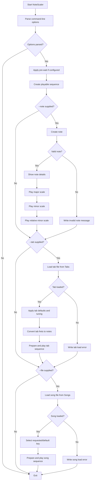

# NoteScaler

NoteScaler is a command-line music practice tool. It can display note details, play scales for a note, play song JSON files from the `Songs` directory, and play tablature JSON files from the `Tabs` directory.

This README focuses only on running the tool and using the command-line options.

## Running NoteScaler

From the repository root during development:

```bash
 dotnet run --project NoteScaler -- [options]
```

After publishing or installing the executable:

```bash
 NoteScaler.exe [options]
```

The `--` in the `dotnet run` form tells the .NET CLI to pass the remaining arguments to NoteScaler instead of treating them as `dotnet run` options.

## Common examples

Display note details and play the major, minor, and relative minor scales for C:

```bash
 dotnet run --project NoteScaler -- --note C
```

Use a different octave and A4 tuning reference:

```bash
 dotnet run --project NoteScaler -- --note A --octave 4 --range 432
```

Play a song file named `amazinggrace.json` from the `Songs` directory:

```bash
 dotnet run --project NoteScaler -- --file amazinggrace
```

Play a specific key/variation from a song file:

```bash
 dotnet run --project NoteScaler -- --file amazinggrace --key C
```

Play a tab file named `anotherbrickinthewallpart2.json` from the `Tabs` directory:

```bash
 dotnet run --project NoteScaler -- --tab anotherbrickinthewallpart2
```

Play a tab using a custom string instrument definition file:

```bash
 dotnet run --project NoteScaler -- --tab my-seven-string-tab --string-instruments NoteScaler/Instruments/custom-instruments.sample.json --string-instrument "Seven String Drop A"
```

Pause before playback, then play using a different instrument voice:

```bash
 dotnet run --project NoteScaler -- --note C --prewait 2 --speed 300 --instrument Flute
```

## Custom string instrument JSON

Custom string instruments are supplied with `--string-instruments <path>`. If the file contains more than one instrument, select one with `--string-instrument <name>`.

```json
{
  "instruments": [
    {
      "name": "Seven String Drop A",
      "strings": 7,
      "frets": 24,
      "capo": 0,
      "openStrings": [
        { "number": 1, "note": "E4" },
        { "number": 2, "note": "B3" },
        { "number": 3, "note": "G3" },
        { "number": 4, "note": "D3" },
        { "number": 5, "note": "A2" },
        { "number": 6, "note": "E2" },
        { "number": 7, "note": "A1" }
      ]
    }
  ]
}
```

`capo` is optional and defaults to `0`. When supplied, NoteScaler treats the configured open string note as the physical open tuning and shifts the sounding open note upward by the capo fret count.

## Command-line options

| Short | Long | Default | Description |
|---|---|---:|---|
| `-r` | `--range` | `440` | A4 reference frequency. Use this to tune calculations to a different A4 reference, such as `432`. |
| `-o` | `--octave` | `3` | Starting octave used when a note does not already include an octave. |
| `-w` | `--prewait` | `0` | Number of measures to wait before playback begins. The wait time is `prewait * speed`. |
| `-k` | `--key` | `null` | Selects a named key or variation when playing a song file. |
| `-s` | `--speed` | `300` | Measure duration used for note timing. Smaller values play faster; larger values play slower. |
| `-i` | `--instrument` | `Horn` | Instrument voice used for playback. Valid values are `Horn`, `Flute`, `Clarinet`, and `Recorder`. |
| `-n` | `--note` | `null` | Displays details for a note and plays its major, minor, and relative minor scales. |
| `-f` | `--file` | `null` | Plays a JSON song file from the `Songs` directory. Pass the file name without `.json`. |
| `-t` | `--tab` | `null` | Plays a JSON tab file from the `Tabs` directory. Pass the file name without `.json`. |
|  | `--string-instruments` | `null` | Path to a JSON file that defines custom string instruments for tab playback. |
|  | `--string-instrument` | `null` | Name of the custom string instrument to use from `--string-instruments`. Required when the file defines more than one instrument. |

## Operation order

When multiple operation options are supplied, NoteScaler processes them in this order:

1. Parse command-line options.
2. Apply `--prewait` if configured.
3. Create the playable sequence.
4. Process `--note` if supplied.
5. Process `--tab` if supplied. If `--string-instruments` is supplied, the selected custom string instrument is used for tab fret resolution.
6. Process `--file` if supplied.

That means a command can technically include more than one operation option, but the clearest usage is to run one primary operation at a time: `--note`, `--tab`, or `--file`.

## Flow chart


